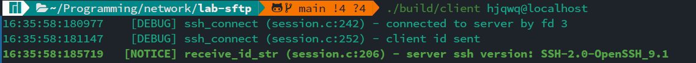
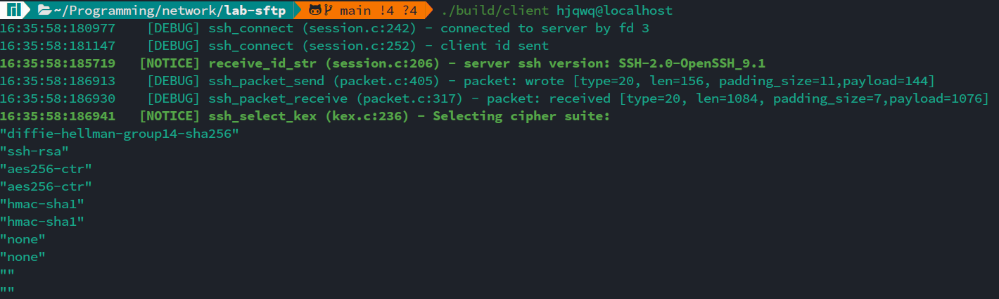
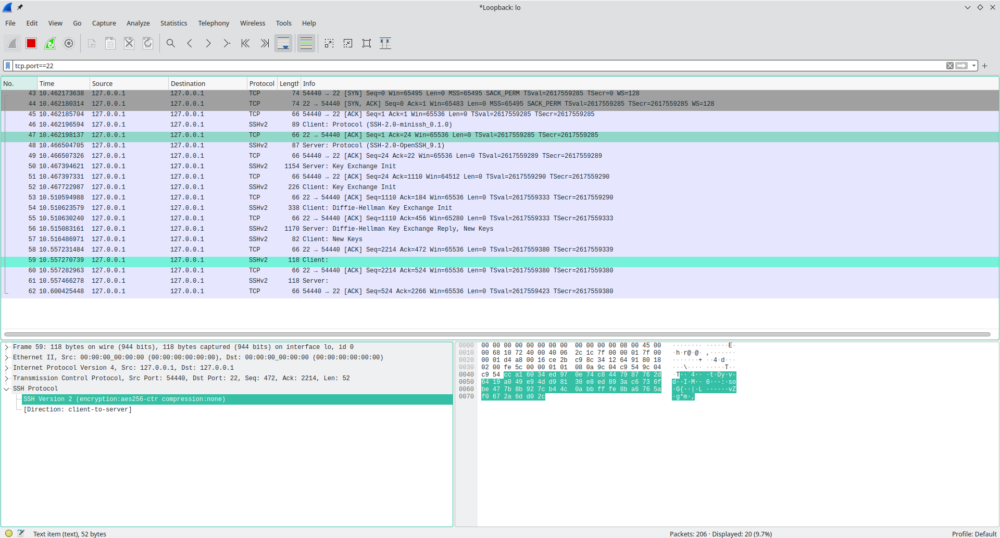
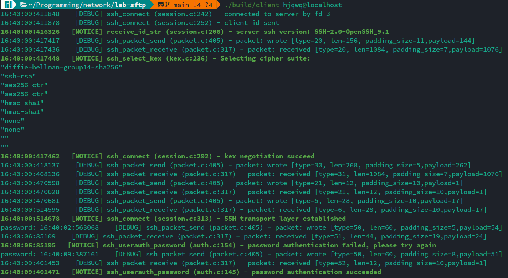
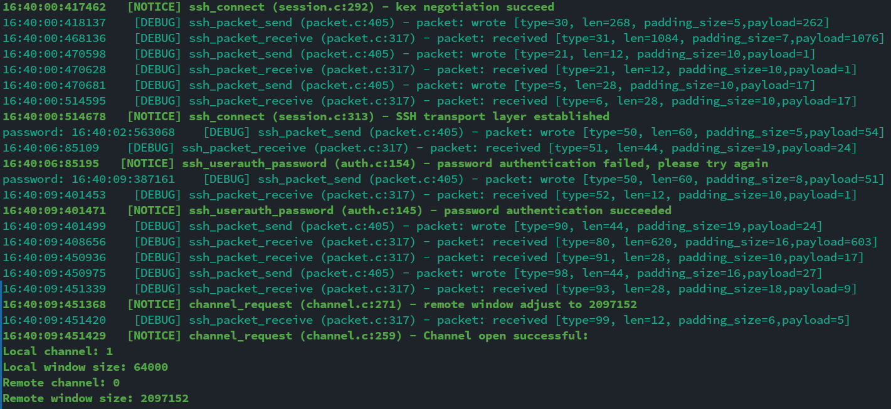
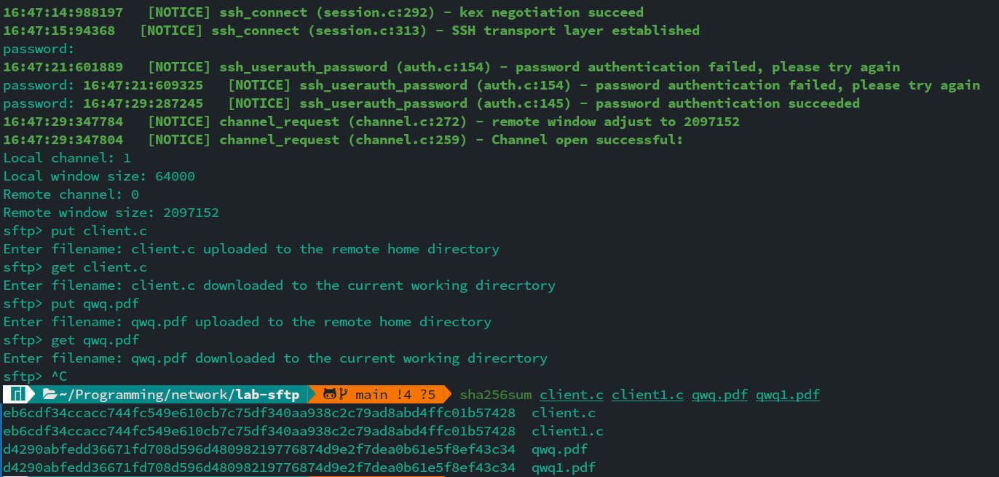

# Lab4 report

## 胡晋侨 2000013141 吴清月 2000013057

Since `ssh-rsa` is deprecated, the client cannot connect to most of the remote servers. Thus all the tests here are done by connecting to the localhost, where we explicitly enabled `ssh-rsa`.

### CP 1



We can see that the ssh version of server(localhost) is `SSH-2.0-OpenSSH_9.1`

### CP2



The negotiated cipher suite is

```
"diffie-hellman-group14-sha256"
"ssh-rsa"
"aes256-ctr"
"aes256-ctr"
"hmac-sha1"
"hmac-sha1"
"none"
"none"
""
""
```

### CP3



After both sides have sent `New Keys`, wireshark cannot determine the content of the TCP payload.

### CP4



First, a wrong password was rejected by the server. Then the server authenticated the correct password.

### CP5



When `channel_open` first returned, the remote window size was set to `0`. Then after `channel_request`, the remote window size was set to `2097152`.

### CP6



To test transfer of larger files, we used a pdf file which is of size `12MB`. We first make backup for `client.c` and `qwq.pdf`, named as `client1.c` and `qwq1.pdf` respectively. We then upload the file to the server, and download them from the server. Then we compare them with the original files using `sha256sum`. It shows that our implementation keeps the integrity of files.
